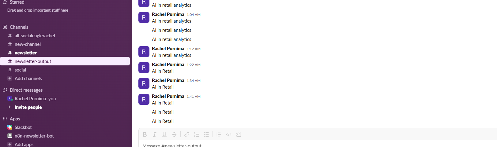
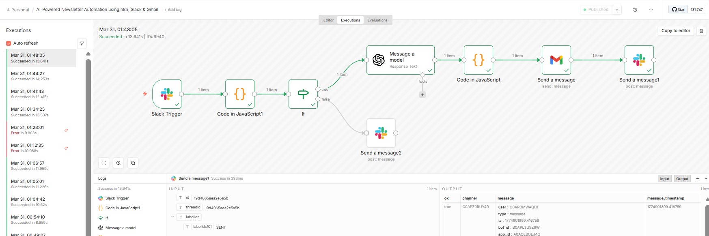
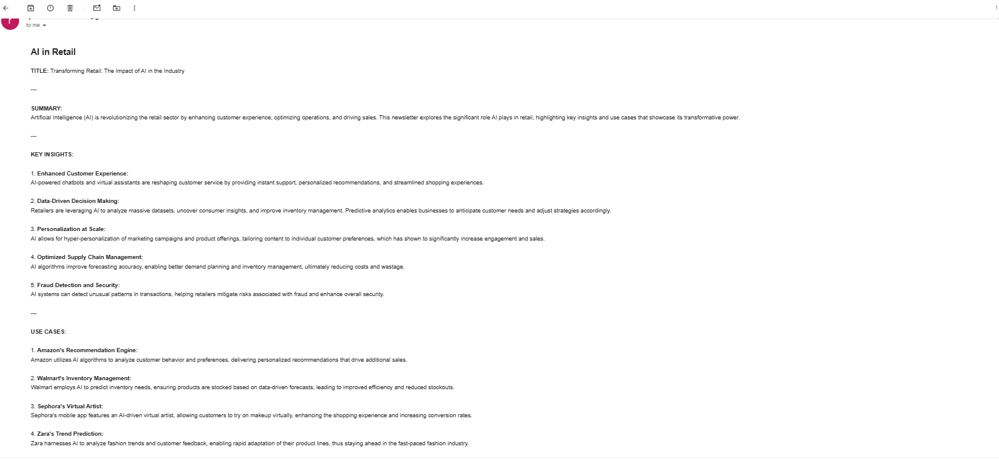
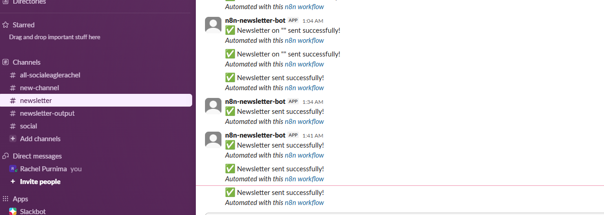

# 🚀 AI-Powered Newsletter Automation using n8n, Slack & Gmail

An end-to-end **AI-driven automation system** that generates and delivers newsletters in real time using **Slack, n8n, and Gmail**.

---

## 🔥 Project Overview

This project demonstrates how to build a **real-world automation pipeline** that:

📩 Takes user input directly from Slack  
⚙️ Triggers an automated workflow in n8n  
🤖 Uses AI to generate structured newsletter content  
🧾 Formats content into a readable email  
📧 Sends it via Gmail  
✅ Confirms delivery back in Slack  

👉 This simulates real-world use cases like:

- Marketing automation  
- Business reporting  
- Internal communication workflows  

---

## 🎯 Objective

The goal of this project is to:

- Automate newsletter creation using AI  
- Reduce manual effort in content generation  
- Enable real-time interaction through Slack  
- Deliver structured and formatted output via email  
- Provide instant feedback to the user  

---

## 🏗️ Architecture

[User Input - Slack]
│
▼
[n8n Webhook Trigger]
│
▼
[Input Processing (Code Node)]
│
▼
[Validation (IF Node)]
│ │
│ └───────────────► [Error → Slack Response]
▼
[AI Model - Content Generation]
│
▼
[Formatting - HTML Email]
│
▼
[Gmail - Send Email]
│
▼
[Slack Confirmation - Success]


---

## 🔄 Workflow Explanation

### 🔹 Slack Trigger Node  
Captures user input and initiates the workflow.

### 🔹 Code Node (Input Processing)  
Extracts `$json.text` and cleans the input.

### 🔹 IF Node (Validation)  
Validates input and controls workflow execution.

### 🔹 AI Model Node  
Generates structured newsletter content.

### 🔹 Code Node (Formatting)  
Formats output into HTML email.

### 🔹 Gmail Node  
Sends the newsletter email.

### 🔹 Slack Node (Success)  
Confirms successful execution.

### 🔹 Slack Node (Error Handling)  
Handles invalid inputs and errors.

---

## ⚙️ Setup Instructions

### 1️⃣ Start n8n

```bash
n8n start

Access:

http://localhost:5678
2️⃣ Start ngrok
ngrok http 5678

Example:

https://xxxxx.ngrok-free.dev
3️⃣ Configure Slack App
🔹 Enable Event Subscriptions

Add Request URL:

https://<ngrok-url>/webhook/<your-webhook-id>/webhook
🔹 Subscribe to Events
message.channels
🔹 OAuth Permissions
channels:history
channels:read
chat:write
4️⃣ Add Bot to Channels
#newsletter
#newsletter-output
/invite @your-bot-name
5️⃣ Gmail OAuth Setup

Add redirect URL:

http://localhost:5678/rest/oauth2-credential/callback
Add Gmail as Test User
Connect Gmail in n8n
🧪 Test Scenarios
✅ Valid Input
AI in retail analytics

✔ Newsletter generated
✔ Email sent
✔ Slack confirmation

❌ Invalid Input
hi

✔ Error message shown in Slack

## 📸 Screenshots

### 1. Slack Input


---

### 2. Workflow Execution


---

### 3. Email Received


---

### 4. Slack Output


🚀 Key Features

📩 End-to-end automation
🤖 AI-powered content generation
💬 Slack integration
📧 Email automation
✅ Input validation
🧾 Structured HTML formatting

🧠 Key Learnings

🔥 1. Automation + AI = Powerful combination
Bridges communication tools with intelligent systems

🔥 2. Webhooks are critical
Enable real-time event-driven workflows

🔥 3. Input validation improves reliability
Prevents unnecessary AI calls and errors

🔥 4. Workflow orchestration matters
n8n acts as the backbone of the system

🔥 5. AI is just one part of the system
Real value comes from integration + automation

💼 Use Cases
Marketing newsletter automation
Daily/weekly business reports
Internal communication tools
AI-powered content pipelines
⚡ Future Improvements
Scheduled newsletter automation
Multi-topic batch generation
Personalization using AI
Integration with CRM tools
Multi-language support
👩‍💻 Developed By

Rachel Purnima J

📌 Note

This project was built as part of hands-on learning in:

n8n workflow automation
Slack integrations
Gmail OAuth
AI-powered content generation
🌟 Final Thought

Building real-world GenAI systems is not just about generating content —

👉 it's about connecting tools, automating workflows, and delivering value in real time.

